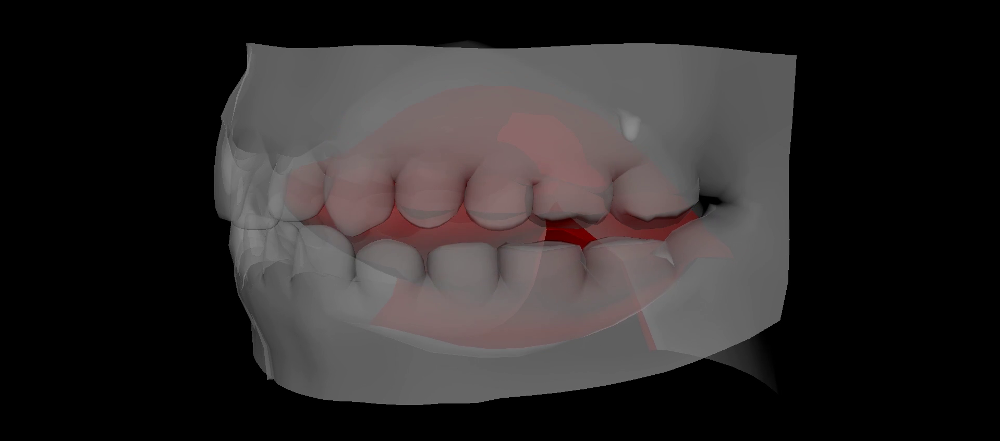

# Speech Driven Tongue Animation



This repository has the code for submission 7201. The data, pre-trained models, and facial rig will be released upon publication.

For clarification purposes this repository has the code for training, testing and visualizing the results shown in the video.
The rig optimization and visualization scripts are in Maya and Unreal Engine. Those will also be provided upon acceptance.

## Installation

The conda environment to run the training and prediction code is  `./envs/speechanim.yml` and the environment to generate the animations using MayaVI is `./envs/tongueanim.yml`.
To install any of the environments on your machine you need to run:

```
conda env create -f ./envs/speechanim.yml
conda env create -f ./envs/speechanim.yml
```


## Data

The link to download the processed data for training and testing to reproduce the results will be released upon acceptance.


## Training and Prediction

### Training
To train any of the models with the provided data you need to call any of the training scripts for the `X` architecture with the `F` audio feature as follows:

```
train_X.py -l configs/local.yml -c ./training/X/F/in_15/train_X.yaml
```

The `./configs/local.yaml` sets the path where you have stored the data, where the models and training logs will be saved, as well as the animations.

Under the `./configs/training` folder you will find all the configurations to train each of the models presented in the paper.

### Prediction

To run an inference of the trained models using any of the `predic_X_ckpt.py` scripts.


## Visualizing the data and predictions

To visualize the predicted and ground-truth EMA landmarks you can do it through the `animate_landmarks.py` as follows:

```
python3 -u animate_landmarks.py -i <prediction_npy> \
                                -v <view> \
                                -sz <HxW> \
                                -r <rotate_bool> \
                                -l <loop_bool> \
                                -t <theme> \
                                -gt <gt_flag> \
                                -o <output_dir> 
```
The parameters are described as follows:
- `-i`: Path to the npy file which has the predicted pose
- `-v`: View of the render: left, center, right
- `-sz`: Output frame size with HeightxWidth, e.g. 640x480
- `-r`: Rotate the model over the z-axis during the animation
- `-l`: Loop the displayed animation
- `-t`: Sets the color theme of the render: dark, light
- `-gt`: Indicates if the sample comes from the provided capture data
- `-o`: Path to the directory where the frames will be stored

Once the frames have been created in the `<output_frames_dir>` you can create the video using `ffmpeg` as follows:

```
ffmpeg -i <output_frames_dir>/%04d.jpg -i <path_to_wav> video.mp4
```
